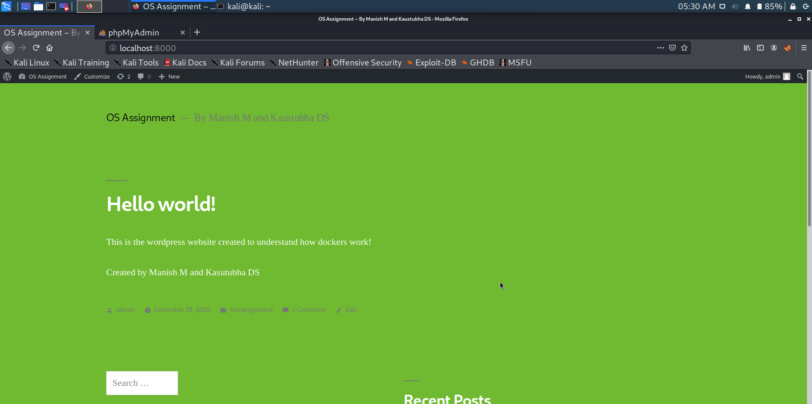
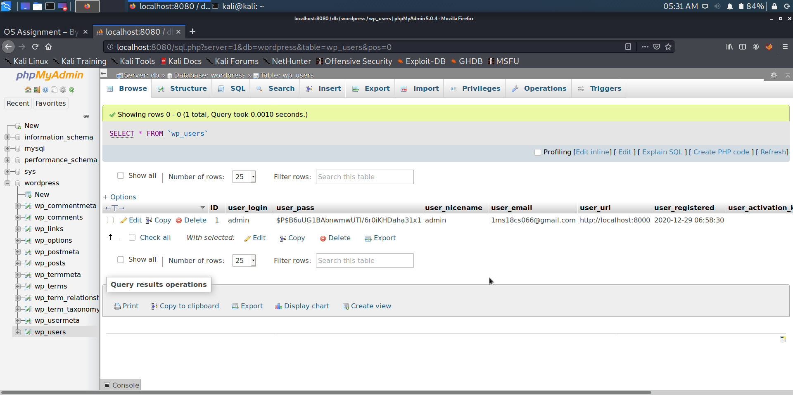
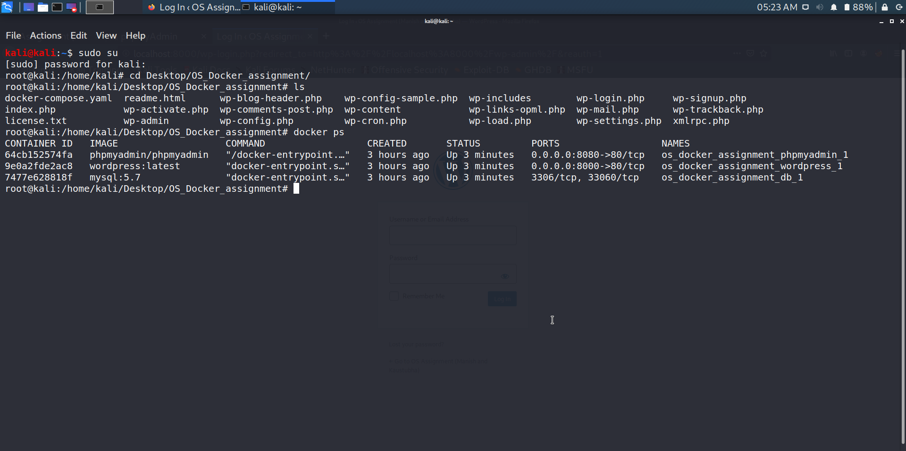

# OS-Dockers-Assignment

OS Dockers assignment number <b>3</b>

<b>Team members:</b> 
Manish M - 1MS18CS066 
Kaustubha DS - 1MS18CS058 
 

localhost:8000 -> Wordpress 
localhost:8080 -> PhpMyAdmin

 

<h2> Sample wordpress website </h2>
  

<h2> PhpMyAdmin </h2>
  

<h2> Terminal </h2>

Virtual machine (Kali Linux) was used for the execution

